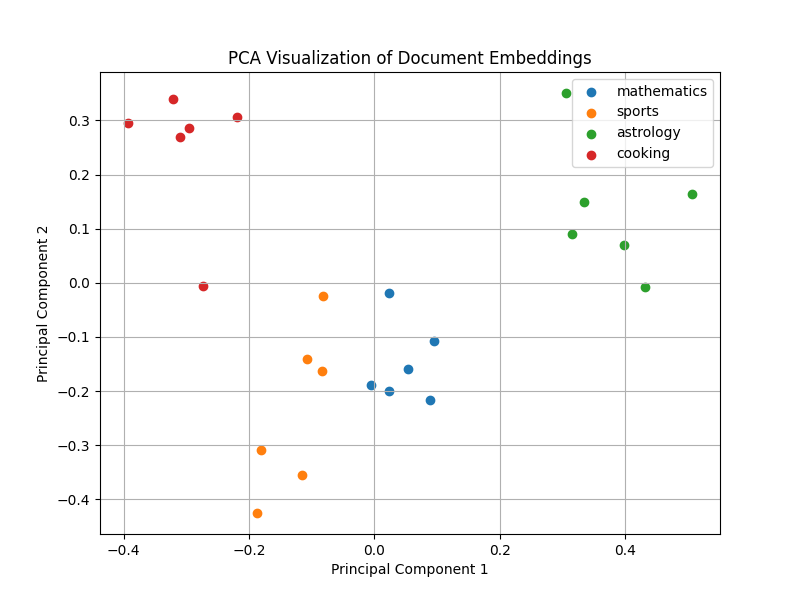

# Submitted for Lab 3

## Semantic Search Engine

This lab implements a semantic search system using text embeddings, cosine similarity, and Principal Component Analysis (PCA).

The lab consists of:

- **Part A:** Generating document embeddings using NVIDIA NIM embeddings API and offline embedding mode.
- **Part B:** Building a semantic search engine using cosine similarity to retrieve the most relevant documents.
- **Part C:** Visualizing the embedding space using PCA with Singular Value Decomposition (SVD).

The project includes a custom document corpus containing 24 documents across four distinct topics:

- Cooking
- Sports
- Astrology
- Mathematics

Each document is converted into an embedding representation, allowing the search engine to retrieve results based on semantic meaning rather than exact keyword matching.

## How to Run

1. Install the required dependencies:

```bash
pip3 install -r requirements.txt
```

2. Create a `.env` file in the project folder and add your NVIDIA API key and add an embedding_mode variable:

```bash
NVIDIA_API_KEY="your_nvidia_api_key_here"

LAB3_EMBEDDING_MODE="offline" 
```
or
```bash
LAB3_EMBEDDING_MODE="api"
```

3. Run the semantic search program:

```bash
python3 search.py
```

The script:
- Loads documents from `documents.json`
- Generates embeddings or loads them from cache
- Performs semantic similarity searches
- Displays the top-k most relevant documents
- Generates a PCA visualization of the embedding space

## Embedding Modes

The program supports two embedding modes:

- **Offline Mode:** Uses a local hashed bag-of-words embedding implementation. This mode requires no API key and can be used to test the complete pipeline locally.
- **API Mode:** Uses NVIDIA NIM's `nvidia/nv-embedqa-e5-v5` embedding model for semantic embeddings.

The embedding mode can be controlled using the `LAB3_EMBEDDING_MODE` environment variable.

For offline mode:

```bash
LAB3_EMBEDDING_MODE=offline
```

For NVIDIA API mode:

```bash
LAB3_EMBEDDING_MODE=api
```

When using API mode, create a `.env` file containing:

```bash
NVIDIA_API_KEY=your_api_key_here
```

## Semantic Search

The search engine:

- Converts documents into embeddings using `input_type="passage"`
- Converts search queries into embeddings using `input_type="query"`
- Computes cosine similarity between query and document embeddings
- Returns the top-k highest scoring documents

Example queries tested:

```
1. How does one bake bread?
```

Returns relevant cooking documents.

```
[0.422] (cooking) Baking bread requires yeast to ferment the dough and create air pockets.
[0.286] (cooking) Simmering soup over low heat allows flavors to blend gradually.
[0.265] (cooking) Boiling pasta in well-salted water improves its flavor and texture.
```

```
2. How do you score a goal?
```

Returns relevant sports documents.

```
[0.440] (sports) Football is played between two teams that compete to score goals.
[0.427] (sports) Basketball players score points by shooting the ball through the opponent's hoop.
[0.324] (sports) Tennis matches are won by earning enough sets according to the tournament rules.
```


## Embedding Cache

Document embeddings are persisted in:

```
embeddings_cache.json
```

The program loads cached embeddings on subsequent runs instead of recomputing them, reducing unnecessary API calls.

The cache is rebuilt when:
- The number of documents changes
- The embedding dimensions do not match the current embedding mode

## PCA Visualization

The embedding space is visualized using PCA implemented through Singular Value Decomposition (SVD).

The high-dimensional embeddings are reduced to two principal components and plotted in a 2D scatter plot.

Each point represents one document and is colored according to its topic, allowing visualization of semantic clustering between different topics.



## Files

- `embeddings.py` - Implements embedding generation using offline mode and NVIDIA NIM API mode.
- `search.py` - Implements document loading, embedding matrix creation, caching, cosine similarity search, and PCA visualization.
- `documents.json` - Contains the custom corpus of documents with topic labels, text passages, and unique IDs.
- `requirements.txt` - Lists required Python dependencies.
- `README.md` - Project documentation.
- `PCA_prompts.png` - Sample PCA output
